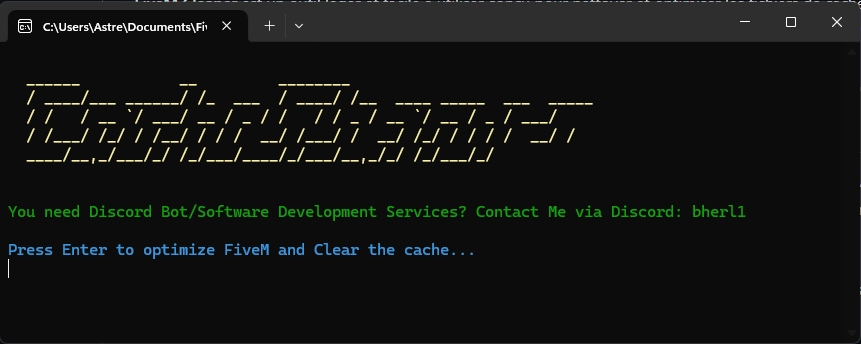

# FiveM Cleaner

  
**FiveM Cleaner** is a lightweight and easy-to-use tool designed to clean and optimize **FiveM** cache files. Whether you're a regular player or a server administrator, this tool simplifies the process of cleaning unnecessary files and optimizing performance for a smoother gaming experience.

---

## 🚀 **Features**

- **FiveM Cache Cleaning**: Remove temporary and unnecessary files that may slow down your system.
- **Performance Optimization**: Free up space and improve game speed by removing outdated files.
- **User-Friendly Interface**: A simple and intuitive interface for a hassle-free experience.
- **Lightweight**: The tool is optimized for minimal resource usage while maintaining high performance.

---

## 📸 **Screenshots**

Here are a few screenshots of the app in action:



---

## 🛠️ **Prerequisites**

Before you can run **FiveM Cleaner** locally, you'll need to have the following installed:

- **[Node.js](https://nodejs.org/)** (LTS version recommended)
- **npm** (comes pre-installed with Node.js)

Check if Node.js and npm are installed by running the following commands in your terminal:

```bash
node -v
npm -v
```

---

## 📥 **Installation**

### Clone the Repository

First, clone this repository to your local machine:

```bash
git clone https://github.com/Bherl1/FiveMCleaner.git
cd FiveMCleaner
```

### Install Dependencies

Navigate to the project folder and install all required dependencies:

```bash
npm install
```

### Running the Application

To run the app in development mode, use the following command:

```bash
npm run start
```

This will open the app with the cache cleaning interface.

---

## ⚙️ **Precompiled Executable (Windows)**

For Windows users, you can download a precompiled `.exe` file from the **Releases** section:

1. Go to the [Releases](https://github.com/Bherl1/FiveMCleaner/releases).
2. Download the `.exe` file.
3. Double-click the `.exe` to launch the app.

This version is ready-to-use and doesn't require Node.js or npm setup.

---

## 📝 **Usage**

Once the application is running, you will be presented with a simple and intuitive interface that allows you to:

- **Clean Cache**: Remove temporary files and cache associated with your FiveM installation.
- **Optimize Performance**: Free up disk space and improve performance by removing outdated files.

Follow the on-screen instructions to get started and refer to the in-app help for more details.

---

## 🤝 **Contributing**

We welcome contributions from the community! If you'd like to contribute to **FiveM Cleaner**, please follow these steps:

1. Fork the repository.
2. Create a new branch (`git checkout -b feature/your-feature`).
3. Make your changes and commit them (`git commit -am 'Add new feature'`).
4. Push to your fork (`git push origin feature/your-feature`).
5. Open a pull request on GitHub.

We kindly ask that you ensure your code follows the existing style and passes all tests.

---

## 💡 **Ideas for Improvement**

Here are a few ideas for future improvements that you might want to consider contributing to:

- **Multi-Platform Support**: Add support for macOS and Linux by building from source.
- **Enhanced GUI**: Add more interactive features for advanced users.

---

## 📄 **License**

This project is licensed under the **MIT License** - see the [LICENSE](https://github.com/Bherl1/FiveMCleaner/blob/main/LICENSE) file for details.

---

## 🔗 **Links**

- **Discord**: [Join our community](https://discord.gg/7wVU2jnjey)
- **Bug Tracker**: [Report an issue](https://github.com/Bherl1/FiveMCleaner/issues)

---

## 🙏 **Acknowledgments**

A big thank you to the following libraries and tools that made this project possible:

- [Node.js](https://nodejs.org/)
- [npm](https://npmjs.com/)

And of course, **thank you** for your interest in **FiveM Cleaner**! We hope this tool improves your gaming experience.

---

### 🛠️ **Technologies Used**

- **Frontend**: Node.js
- **Package Management**: npm

---

### 🏆 **Support and Feedback**

If you encounter any issues or have suggestions for improvement, feel free to open an issue in the [Issues](https://github.com/Bherl1/FiveMCleaner/issues) section, or contact us directly.
